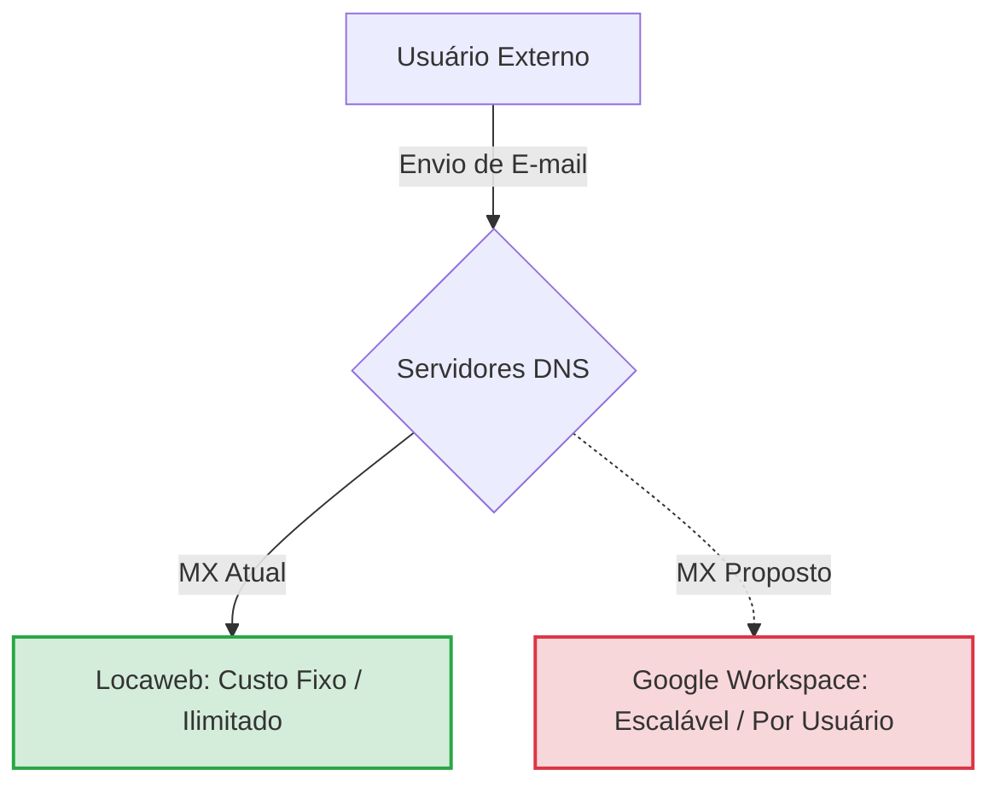

_Comandos markdown essenciais para criação de materiais e textos na web_

---
### Titles

```
# Título
## Subtítulo
### Subtítulo
#### Subtítulo
##### Subtítulo
###### Subtítulo
```

Exemplo: 

# Título
## Subtítulo
### Subtítulo
#### Subtítulo
##### Subtítulo
###### Subtítulo

---
### Writing

**negrito**:
```**example**``` → **example**
**ou**
```__example__``` → __example__

**itálico**:
```*example*``` → *example*
**ou**
```_example_``` →  _example_

**tachado**:
```~~example~~``` → ~~example~~

**Citação**:
```> Citação``` ↓
>Citação 

---
### Links

**Acessar o link externo** → ```[Link](https://example.com)```

[Meu Github](https://github.com/xmezmerize)

**Acessar seção:**
```
# Títulos → (acessa a seção)

(conteúdo)

--- 

# Compras

(conteúdo)

---

# Contatos

(conteúdo)

---

 ↓nome_destaque↓  ↓seção↓
[Ir para Títulos](#Títulos)
```
Exemplo:

[Ir para Títulos](#Títulos)

**Acessar arquivo:**
```
/root
/home/arquivo → (acessa o arquivo)

 ↓nome_destaque↓ ↓link_arquivo↓
[Ir para arquivo](/home/arquivo)
```
Exemplo:

[Ir para arquivo](home/arquivo)

**Acessar imagem** → ``````


---
### Tables and Marks

**Caixa de marcação**:
```
- [x] tarefa feita
- [ ] tarefa pendente
```
Exemplo:

- [x] tarefa feita
- [ ] tarefa pendente

**Lista**:
```
- item
- item 2
- item 3
```
Exemplo: 

- item
- item 2
- item 3

**Tabela**:
```
| Nome | Idade |
| ---- | ----- |
| Ana  | 20    |
| João | 25    |
```
Exemplo:

| Nome | Idade |
| ---- | ----- |
| Ana  | 20    |
| João | 25    |
|      |       |

**Lista enumerada**:
```
1. Primeiro
2. Segundo
3. Terceiro
```
Exemplo:

1. Primeiro
2. Segundo
3. Terceiro

---
### Lines

**Fazer uma linha → ```---``` 

**Identação (Tab)**:
```
a
	b
		c
			d
```
Exemplo:

a
	b
		c
			d

---
### Callout

| Tipo              | Sinônimos / Aliases    | Propósito / Cor                                        |
| ----------------- | ---------------------- | ------------------------------------------------------ |
| **`[!note]`**     | -                      | Nota geral ou lembrete (Azul)                          |
| **`[!abstract]`** | `summary`, `tldr`      | Resumo, sumário ou visão geral (Verde-azulado / Teal)  |
| **`[!info]`**     | -                      | Informação extra ou contexto (Azul claro)              |
| **`[!todo]`**     | -                      | Tarefas e itens de ação (Azul)                         |
| **`[!tip]`**      | `hint`, `important`    | Dica, conselho ou atalho (Ciano)                       |
| **`[!success]`**  | `check`, `done`        | Conquistas, acertos ou itens concluídos (Verde)        |
| **`[!question]`** | `help`, `faq`          | Perguntas abertas ou dúvidas a resolver (Amarelo)      |
| **`[!warning]`**  | `caution`, `attention` | Alertas sobre potenciais problemas ou riscos (Laranja) |
| **`[!failure]`**  | `fail`, `missing`      | Falhas, erros ou itens ausentes (Vermelho escuro)      |
| **`[!danger]`**   | `error`                | Riscos graves ou falhas críticas (Vermelho vivo)       |
| **`[!bug]`**      | -                      | Erros de sistema ou _bugs_ conhecidos (Vermelho)       |
| **`[!example]`**  | -                      | Exemplos práticos ou cenários (Roxo)                   |
| **`[!quote]`**    | `cite`                 | Citações ou referências externas (Cinza)               |

Exemplo de callout:
>[!NOTE] Esse é um exemplo de callout!

---
### mermaid

Comandos:
```
graph TD
    A[Usuário Externo] -->|Envio de E-mail| B{Servidores DNS}
    B -->|MX Atual| C[Locaweb: Custo Fixo / Ilimitado]
    B -.->|MX Proposto| D[Google Workspace: Escalável / Por Usuário]
    style C fill:#d4edda,stroke:#28a745,stroke-width:2px
    style D fill:#f8d7da,stroke:#dc3545,stroke-width:2px
```

Exemplo:



---
### fenced code block

Tipos:
```
Para criar:
``` texto ou código ```

Estilos para usar com ```(vai aqui):

bash / sh
js / javascript
ts / typescript
python
java
c
cpp
csharp
go
rust
php
ruby
kotlin
swift
html
css
json
yaml / yml
xml
sql
markdown / md
dockerfile
ini
toml
powershell
regex
plaintext / text
```
